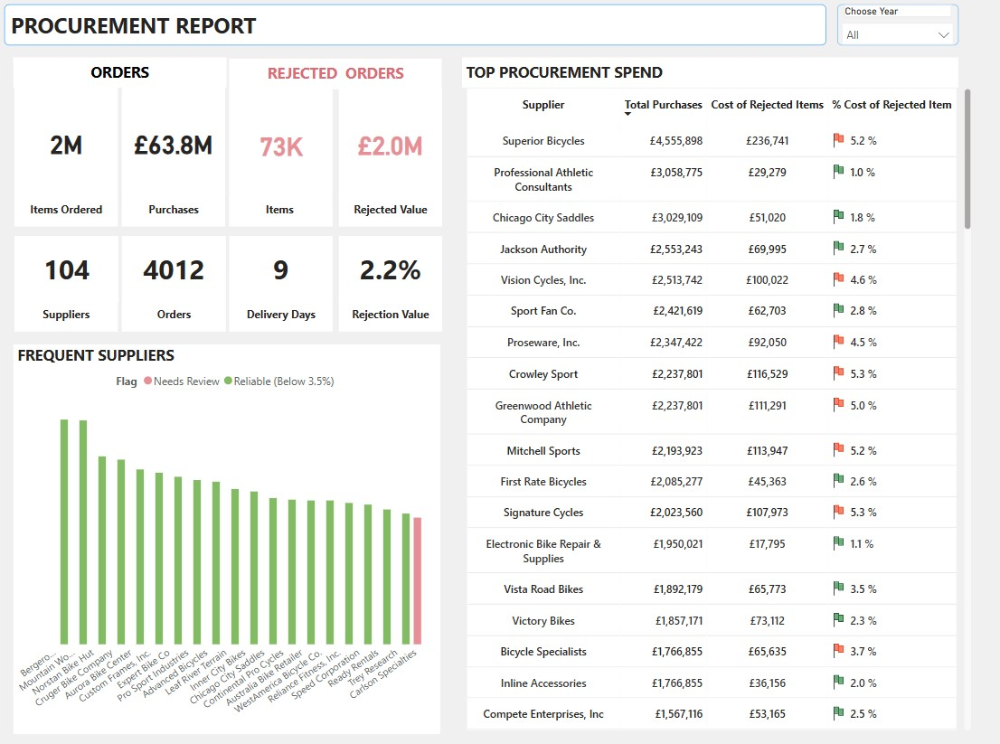

# Data Pipeline for on-premises using Microsoft Fabric.

Using Microsoft Fabric to build data pipeline for a business scenario where data is loaded from an on-premises database and processes into a modern data warehouse for analytical and data science workloads.

## Overview

This project will simulate a typical  retail chain scenario where sales and product data is loaded from an on-premise SQL database and processed into a modern data warehouse using Microsoft Fabric.

  

<b> A Business Scenario</b>

Let's say . . .

A retail business noticed that popular products kept running out while slow movers piled up in storage. To fix this, the management has asked: “Which products might sell out soon, and which ones are overstocked, based on our inventory and recent sales?”

They want an easy way for teams to see sales trends versus inventory, flag products that need quick restocks or clearance, and keep customers happy while cutting excess inventory costs. All the data is in their on-premises database, and now stakeholders want a solution to make this happen.

A solution . . .

Proposes a data pipeline that extracts data daily from the on-premises database, loads it into Azure, and transforms it to create a custom daily report using **Fabric**. This report will show current inventory levels, sales trends, products at risk of selling out soon, and overstocked items. The data will feed into a dashboard, allowing teams to quickly spot which products need restocking or clearance, filter by category, and drill into details. The pipeline will run automatically, ensuring teams always have up-to-date information to make fast decisions and keep inventory balanced.
  

  

## Prerequisite

- Adventure Works database set up on machine. Check here for set up.
- Azure account
- Fabrics setup. For the free trial follow [this](https://www.youtube.com/watch?v=RHV7jZqc_tE)
- Microsoft tenant/ work email.
- [ Medalllion lakehouse architecture](https://learn.microsoft.com/en-us/azure/databricks/lakehouse/medallion)

- Pyspark, SQL

## Data Pipeline Overview

To simulate this, the AdventureWorks database will be used  Data Ingestion from on-premise database. – Migrate data from on-premise to Fabric SQL database.
	

## Implementation Steps

- [Set up  on-prem DB and Fabric](https://github.com/adekolaolat/fabric-data-engineering-on-premises-db/blob/main/guides/on-prem-db-setup.md)
  

Set up

  - SQL Server, SSMS
  - Restore AdventureWorks database
  - Enable Remote Connections to SQL Server
  - Set up on-premises DB on machine

  

- [ Data ingestion - Use Data pipeline to land data from  on-premises into lakehouse.](https://github.com/adekolaolat/fabric-data-engineering-on-premises-db/blob/main/guides/data-ingestion.md)

- [Transformation - Tranform data to silver and  gold tables using PySpark](https://github.com/adekolaolat/bods-liverpool-azure-data-engineering/blob/main/guides/transformation.md)

- [Set up semantic model](https://github.com/adekolaolat/bods-liverpool-azure-data-engineering/blob/main/guides/transformation.md#getting-gold-layer-from-silver)

- [Visualisation -  Set up Semantic model for tables and build report/dashboard in Fabric.](https://github.com/adekolaolat/bods-liverpool-azure-data-engineering/blob/main/guides/data-viz.md)

## Outcome

- #### Report on procurement review of suppliers.

